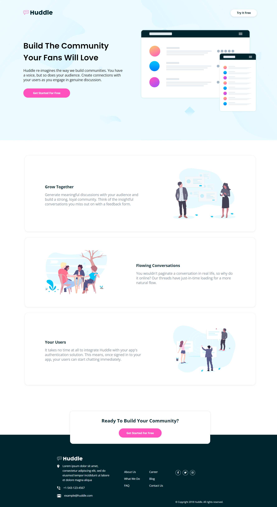

# Huddle-Landing-Page
Huddle landing page with alternating feature blocks

### Frontend Mentor - Huddle landing page with alternating feature blocks solution

This is a solution to the [Huddle landing page with alternating feature blocks challenge on Frontend Mentor](https://www.frontendmentor.io/challenges/huddle-landing-page-with-alternating-feature-blocks-5ca5f5981e82137ec91a5100/hub). 

### The challenge

Users should be able to:

- View the optimal layout depending on their device's screen size
- See hover states for interactive elements

### Screenshot

### Links

- Solution URL: [GitHub repo](https://github.com/manueldinis/huddle-landing-page
- Live Site URL: [https://manueldinisjunior.github.io/huddle-landing-page](https://manueldinisjunior.github.io/huddle-landing-page)

### Built with

- Semantic HTML5 markup
- CSS custom properties
- Flexbox
- Mobile-first workflow

### Useful resources

- [Resource 1.](https://zellwk.com/blog/how-to-write-mobile-first-css/) - An article on how to write mobile-first CSS
- [Resource 2.](https://www.internetingishard.com/html-and-css/flexbox/) - This Flexbox tutorial is a friendly tutorial for modern CSS layouts by [Interneting Is Hard](https://www.internetingishard.com/).

## Author

- Frontend Mentor - [@nicknjagi](https://www.frontendmentor.io/profile/nicknjagi)
- Twitter - [@nick_njagi](https://www.twitter.com/nick_njagi)

